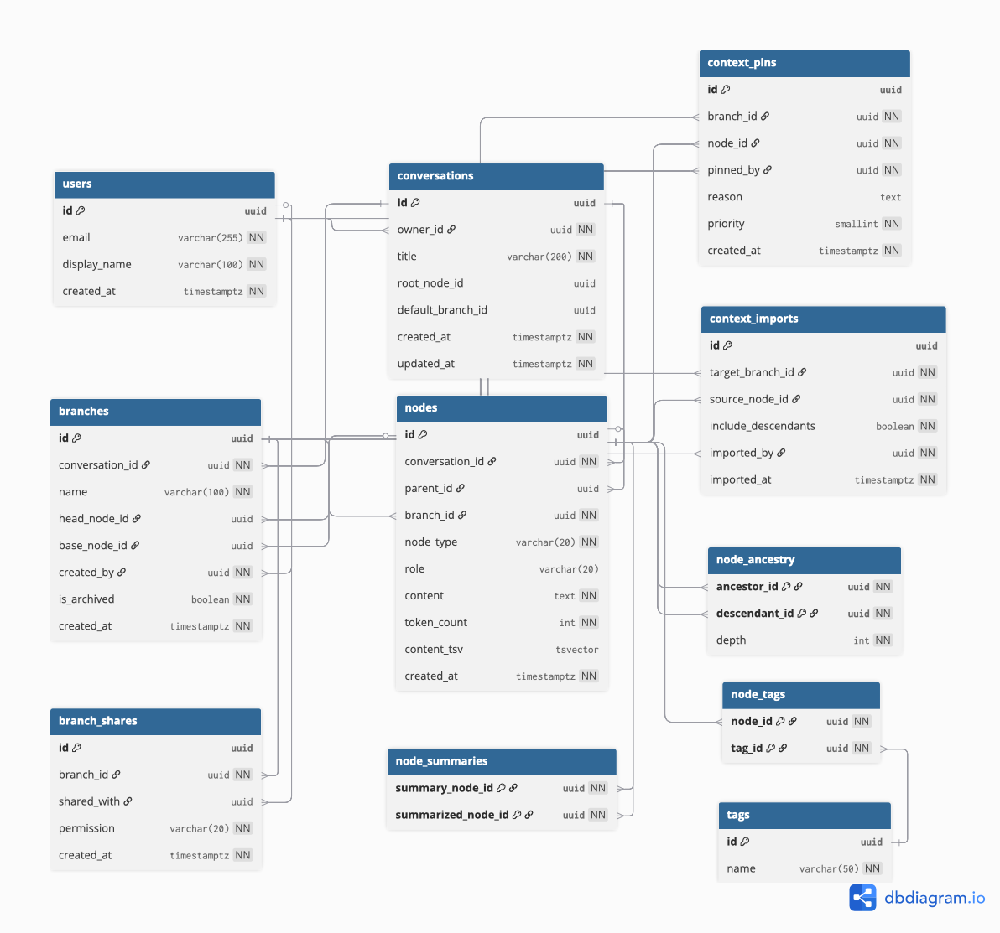

# Graft: Git for AI Conversations

### Database Course Project Presentation

---

## 1. The Problem

Modern AI assistants (Claude, ChatGPT, Copilot) have a fundamental limitation: **conversations are flat lists**. But real work isn't linear.

**Pain points:**
- Conversations grow long, filling the AI's context window with stale information
- You can't try a risky idea without polluting your main conversation thread
- Solutions discovered in one conversation can't be reused in another
- There's no way to say "always remember this" across conversation turns

**Our solution:** Bring **Git-style version control** to AI conversations — branch, commit, pin, cherry-pick, and search across conversation history.

---

## 2. Domain Overview

Graft manages conversation histories as a **directed acyclic graph (DAG)** instead of a flat list.

**Who uses it?** Developers working with AI coding assistants in long, multi-session interactions.

**Core operations:**
- **Branch** — fork a conversation to explore an idea without polluting the main thread
- **Commit** — snapshot a run of messages into a single summary node, freeing token budget
- **Pin** — mark a node as "always include in context" on a specific branch
- **Cherry-pick (Import)** — pull context from one branch into another
- **Search** — find relevant nodes across all conversations via full-text search

---

## 3. Schema at a Glance

**11 tables** organized into four layers:

```
Core Structure          DAG Maintenance         Cross-Branch Context     Organization
─────────────          ───────────────         ────────────────────     ────────────
users                  node_ancestry           context_pins             tags
conversations          (closure table,         context_imports          node_tags
nodes                   trigger-maintained)    node_summaries
branches                                                               Integration
                                                                       ────────────
                                                                       claude_exports
```

**Entity-Relationship Diagram:**



Full DDL: [docs/03_database_schema.md](03_database_schema.md) | DBML: [db/schema.dbml](../db/schema.dbml)

---

## 4. The Node DAG

Every piece of content is a **node**. Nodes form a tree via `parent_id` (self-referential FK).

```sql
CREATE TABLE nodes (
    id              UUID PRIMARY KEY DEFAULT gen_random_uuid(),
    conversation_id UUID NOT NULL REFERENCES conversations(id),
    parent_id       UUID REFERENCES nodes(id),       -- null only for root
    branch_id       UUID NOT NULL REFERENCES branches(id),
    node_type       VARCHAR(20) NOT NULL
                    CHECK (node_type IN ('message','commit','merge','summary')),
    role            VARCHAR(20)
                    CHECK (role IN ('user','assistant','system') OR role IS NULL),
    content         TEXT NOT NULL,
    token_count     INT NOT NULL DEFAULT 0,
    content_tsv     TSVECTOR GENERATED ALWAYS AS (
                        to_tsvector('english', content)
                    ) STORED,
    created_at      TIMESTAMPTZ NOT NULL DEFAULT now()
);
```

**Key design decisions:**
- `node_type` + `role` distinguish messages, commits, and system prompts — all in one table
- `token_count` is pre-computed (not derived on read) because context assembly sums tokens across dozens of nodes per query
- `content_tsv` is a **generated column** — PostgreSQL auto-updates it on every INSERT/UPDATE, no application trigger needed

---

## 5. The Closure Table — Why Not Recursive CTEs?

The most frequent query is **"give me all ancestors of node X"** — this runs on every AI turn.

**Naive approach:** Recursive CTE walks parent → grandparent → ... one hop at a time. Complexity: **O(depth)**.

**Our approach:** Pre-compute **all** ancestor-descendant pairs in `node_ancestry`. Complexity: **O(1)** — a single indexed lookup.

```sql
CREATE TABLE node_ancestry (
    ancestor_id   UUID NOT NULL REFERENCES nodes(id),
    descendant_id UUID NOT NULL REFERENCES nodes(id),
    depth         INT  NOT NULL CHECK (depth >= 0),
    PRIMARY KEY (ancestor_id, descendant_id)
);

CREATE INDEX idx_ancestry_desc_depth ON node_ancestry(descendant_id, depth);
```

### How it stays up to date: the trigger

```sql
CREATE OR REPLACE FUNCTION maintain_node_ancestry()
RETURNS TRIGGER AS $$
BEGIN
    -- Self-referential row: every node is its own ancestor at depth 0
    INSERT INTO node_ancestry (ancestor_id, descendant_id, depth)
    VALUES (NEW.id, NEW.id, 0);

    -- Copy parent's ancestor rows, incrementing depth by 1
    IF NEW.parent_id IS NOT NULL THEN
        INSERT INTO node_ancestry (ancestor_id, descendant_id, depth)
        SELECT na.ancestor_id, NEW.id, na.depth + 1
        FROM node_ancestry na
        WHERE na.descendant_id = NEW.parent_id;
    END IF;

    RETURN NEW;
END;
$$ LANGUAGE plpgsql;

CREATE TRIGGER trg_node_ancestry
    AFTER INSERT ON nodes
    FOR EACH ROW EXECUTE FUNCTION maintain_node_ancestry();
```

### Example

Insert node C with parent B (whose ancestors are A → B):

| Before | After trigger fires |
|--------|---------------------|
| (A, A, 0) | (A, A, 0) |
| (A, B, 1) | (A, B, 1) |
| (B, B, 0) | (B, B, 0) |
| | **(C, C, 0)** — self |
| | **(B, C, 1)** — parent |
| | **(A, C, 2)** — grandparent |

Now "all ancestors of C" is just `WHERE descendant_id = C` — **one indexed scan, no recursion**.

---

## 6. Query 1: Context Assembly (The Hot Path)

**Business purpose:** *"Build the AI's memory for a single conversation turn — what should it remember?"*

This query runs on **every agent turn**. Given a node and a token budget, it:

1. Finds all **ancestors** via the closure table
2. Adds **pinned** nodes (user-specified "always include")
3. Adds **imported** nodes (cherry-picked from other branches)
4. **Elides** nodes that have been summarized (replaced by their commit node)
5. **Ranks** by priority → source type → depth → recency
6. **Truncates** at the token budget using a cumulative sum

### CTE-by-CTE walkthrough

```
┌─────────────────┐     ┌──────────────┐     ┌────────────────┐
│ ancestor_nodes  │     │ pinned_nodes │     │ imported_nodes │
│ (closure table) │     │ (context_pins)│     │(context_imports)│
└────────┬────────┘     └──────┬───────┘     └───────┬────────┘
         │                     │                      │
         └─────────┬───────────┘──────────────────────┘
                   ▼
            ┌─────────────┐
            │  candidates  │  ← UNION of all three sources
            └──────┬──────┘
                   ▼
            ┌─────────────┐
            │   elided     │  ← nodes replaced by summaries
            └──────┬──────┘
                   ▼
            ┌─────────────┐
            │   ranked     │  ← ORDER BY priority, source, depth, recency
            └──────┬──────┘
                   ▼
            ┌─────────────┐
            │  budgeted    │  ← SUM(token_count) OVER ... ≤ budget
            └──────┬──────┘
                   ▼
              Final result
```

### Key SQL excerpts

**Ancestors** (via closure table — O(1)):
```sql
ancestor_nodes AS (
  SELECT n.id, n.content, n.token_count, na.depth,
         0::smallint AS pin_priority, 'ancestor' AS source
  FROM node_ancestry na
  JOIN nodes n ON n.id = na.ancestor_id
  WHERE na.descendant_id = :current_node_id
)
```

**Imported nodes** (with optional subtree expansion):
```sql
imported_nodes AS (
  SELECT DISTINCT n.id, n.content, n.token_count,
         0::smallint AS pin_priority, 'imported' AS source
  FROM context_imports ci
  JOIN node_ancestry na
    ON na.ancestor_id = ci.source_node_id
   AND (ci.include_descendants OR na.descendant_id = ci.source_node_id)
  JOIN nodes n ON n.id = na.descendant_id
  WHERE ci.target_branch_id = <current_branch>
)
```

**Elision** (remove nodes replaced by summaries):
```sql
elided AS (
  SELECT ns.summarized_node_id AS node_id
  FROM node_summaries ns
  WHERE ns.summary_node_id IN (SELECT id FROM candidates)
)
```

**Token budget truncation** (window function):
```sql
budgeted AS (
  SELECT *, SUM(token_count) OVER (ORDER BY rank) AS running_tokens
  FROM ranked
)
SELECT * FROM budgeted WHERE running_tokens <= :budget
```

---

## 7. Query 2: Branch Divergence

**Business purpose:** *"Compare two conversation branches — what did each explore that the other didn't?"*

Given two branches A and B:
1. Find ancestor sets of each branch's head (via closure table)
2. Compute the **Lowest Common Ancestor (LCA)** — the most recent shared node
3. Compute **set differences** — nodes exclusive to each side

```sql
-- Ancestor sets
a_ancestors AS (
  SELECT na.ancestor_id, na.depth
  FROM node_ancestry na
  WHERE na.descendant_id = (SELECT head_node_id FROM branches WHERE id = :branch_a)
),

-- LCA = common ancestor with smallest max-depth across both sides
common AS (
  SELECT a.ancestor_id, GREATEST(a.depth, b.depth) AS max_depth
  FROM a_ancestors a
  JOIN b_ancestors b ON a.ancestor_id = b.ancestor_id
),
lca AS (
  SELECT ancestor_id AS lca_node_id FROM common
  ORDER BY max_depth ASC LIMIT 1
),

-- Nodes exclusive to each side
only_a AS (
  SELECT ancestor_id AS node_id FROM a_ancestors
  EXCEPT SELECT ancestor_id FROM b_ancestors
)
```

**Returns:** LCA node ID, count of exclusive nodes per side, and the actual node IDs for display.

---

## 8. Query 3: Full-Text Search

**Business purpose:** *"Search all conversations for relevant context to cherry-pick into the current branch."*

Uses PostgreSQL's native full-text search with `websearch_to_tsquery` (supports Google-style syntax: `OR`, `-exclude`, `"exact phrase"`):

```sql
SELECT
  n.id, n.content, n.role, b.name AS branch_name,
  c.title AS conversation_title,
  ts_rank(n.content_tsv, websearch_to_tsquery('english', :query_text)) AS rank
FROM nodes n
JOIN branches b      ON b.id = n.branch_id
JOIN conversations c ON c.id = n.conversation_id
WHERE c.owner_id = :user_id
  AND b.is_archived = false
  AND n.content_tsv @@ websearch_to_tsquery('english', :query_text)
ORDER BY rank DESC, n.created_at DESC
LIMIT :k;
```

**How `content_tsv` works:**
- Generated column: `GENERATED ALWAYS AS (to_tsvector('english', content)) STORED`
- Automatically updated on every INSERT/UPDATE — no application-level trigger
- The `'english'` dictionary handles stemming (`"running"` → `"run"`)
- Indexed with GIN for O(log n) matching

---

## 9. Index Strategy

| Index | Table | Columns | Type | Purpose |
|-------|-------|---------|------|---------|
| PK | node_ancestry | (ancestor_id, descendant_id) | B-tree | Closure table lookups (Q1, Q2) |
| idx_ancestry_desc_depth | node_ancestry | (descendant_id, depth) | B-tree | "All ancestors of X" — the key Q1 access pattern |
| idx_nodes_content_tsv | nodes | content_tsv | **GIN** | Full-text search matching (Q3) |
| idx_nodes_conv_recent | nodes | (conversation_id, created_at DESC) | B-tree | Recent messages in a conversation |
| idx_pins_branch_priority | context_pins | (branch_id, priority DESC) | B-tree | Ordered pin retrieval in Q1 |
| idx_imports_target_recent | context_imports | (target_branch_id, imported_at DESC) | B-tree | Import listing in Q1 |
| idx_branch_active | branches | conversation_id WHERE is_archived=false | **Partial** | Active-branch filtering (Q3) — smaller, faster index |
| idx_conv_owner_recent | conversations | (owner_id, updated_at DESC) | B-tree | "My recent conversations" sorted by activity |
| uniq_branch_name_per_conv | branches | (conversation_id, name) | Unique | Branch names unique per conversation |
| idx_summaries_original | node_summaries | summarized_node_id | B-tree | Elision check in Q1 |

**Notable optimizations:**
- **GIN index** on `content_tsv`: maps each lexeme to the set of rows containing it — O(log n) full-text matching instead of sequential scan
- **Partial index** `idx_branch_active`: only indexes non-archived branches, so queries filtering `is_archived = false` use a smaller, faster index
- **Composite indexes with DESC ordering**: `idx_conv_owner_recent` lets Postgres do a backwards index scan for "top-N most recent" queries without a sort step

---

## 10. Data Integrity

### CHECK constraints
```sql
CHECK (node_type IN ('message', 'commit', 'merge', 'summary'))
CHECK (role IN ('user', 'assistant', 'system') OR role IS NULL)
CHECK (depth >= 0)
```

### UNIQUE constraints
- `(conversation_id, name)` on branches — branch names unique per conversation, not globally
- `(branch_id, node_id)` on context_pins — a node can only be pinned once per branch
- `(node_id, tag_id)` on node_tags — prevents duplicate tag assignments

### Circular FK handling
Conversations reference nodes (`root_node_id`) and branches (`default_branch_id`), but nodes and branches reference conversations. This circular dependency is resolved with **deferred foreign keys**:
```sql
-- Create conversations first with nullable FKs
CREATE TABLE conversations (
    root_node_id UUID,           -- set after first node exists
    default_branch_id UUID,      -- set after main branch exists
    ...
);

-- Add FKs after dependent tables exist
ALTER TABLE conversations ADD CONSTRAINT fk_conv_root_node
    FOREIGN KEY (root_node_id) REFERENCES nodes(id);
ALTER TABLE conversations ADD CONSTRAINT fk_conv_default_branch
    FOREIGN KEY (default_branch_id) REFERENCES branches(id);
```

### Trigger-maintained closure table
`node_ancestry` is **never written to by application code**. The trigger on `nodes` INSERT guarantees consistency. This prevents accidental corruption of ancestor-descendant relationships.

---

## 11. Tech Stack and Architecture

| Layer | Technology | Purpose |
|-------|-----------|---------|
| Database | PostgreSQL (Supabase) | Closure table, FTS, GIN indexes, triggers |
| Backend | FastAPI + SQLAlchemy | 9 routers, Pydantic validation, async SSE |
| Frontend | React 19 + Vite + Tailwind | Thread view, graph view, search, tag management |
| Graph view | ReactFlow + dagre | DAG visualization with interactive node selection |
| LLM | Claude API | Agent turns (Sonnet) + summarization (Haiku) |
| Realtime | Server-Sent Events | 8 event types for live state synchronization |

### Data flow

```
User action (send message, commit, pin, import)
    │
    ▼
FastAPI endpoint (validates, writes to DB)
    │
    ├── SQLAlchemy ORM → PostgreSQL
    │       │
    │       └── Trigger fires (node_ancestry updated)
    │
    └── SSE publish(conv_id, event_type, payload)
            │
            ▼
        Frontend EventSource listener
            │
            └── React state updated in real-time
                (no page refresh needed)
```

---

## 12. Seed Data

The project includes a realistic sample dataset for demonstration:

- **Scenario:** Developer "Alex" building a "RecipeBox" web app across 6 coding sessions
- **2 users**, 1 conversation, **7 branches** (main, feat/auth, feat/recipe-crud, feat/image-upload, spike/s3-upload, spike/cloudinary-upload, feat/search)
- **35+ nodes** covering user messages, assistant replies, system prompts, and commit nodes
- Context pins, imports, summaries, and tags pre-configured

**Seed script:** `python3 db/seed/load_seed.py` — generates deterministic UUIDs from short IDs for reproducibility.

---

## 13. Demo Walkthrough

### What to show:

1. **Create a conversation** — system prompt auto-created, main branch initialized
2. **Send messages** — observe real-time node creation via SSE
3. **Commit** — messages collapse into a single summary node on the graph
4. **Branch** — fork from any node to explore a different approach
5. **Pin** — mark a node as "always include" with priority
6. **Import (cherry-pick)** — pull a node from another branch into current context
7. **Search** — find nodes across conversations with full-text search
8. **Graph view** — visualize the commit DAG with branch colors and import edges
9. **Tag** — organize nodes with labels, filter search by tag

### Live URL

- **Frontend:** Vercel deployment
- **Backend:** Render deployment
- **Database:** Supabase (PostgreSQL)

---

## 14. Key Takeaways

1. **Closure tables** trade write-time work (trigger on INSERT) for read-time performance (O(1) ancestor lookups). For read-heavy workloads like context assembly, this is a decisive win.

2. **Generated columns** (`content_tsv`) eliminate the need for application-level triggers to keep derived data in sync. PostgreSQL handles it transparently.

3. **GIN indexes** are purpose-built for full-text search — they map each lexeme to the set of containing rows, enabling sub-millisecond matching even on large tables.

4. **Partial indexes** (like `idx_branch_active`) are an underused PostgreSQL feature. They index only the rows that match a WHERE clause, producing a smaller, faster index for queries with common filter conditions.

5. **Circular FK dependencies** between tables can be resolved with nullable columns + deferred ALTER TABLE constraints, allowing a clean 5-step atomic transaction for conversation creation.

6. **Window functions** (`SUM() OVER (ORDER BY rank)`) elegantly solve the token-budget truncation problem without cursor-based iteration — the database computes the running total in a single pass.

7. **Server-Sent Events** provide a lightweight alternative to WebSockets for one-directional real-time updates, keeping the frontend synchronized without polling.
